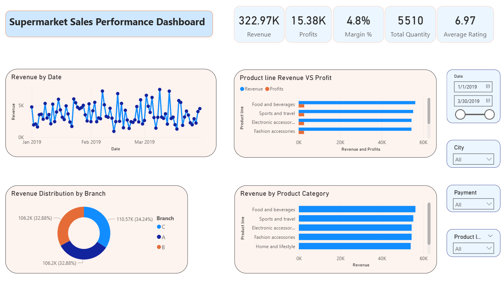

# 🛒 Supermarket Sales Performance Dashboard (Power BI)
## 📸 Dashboard Preview

  

## 📊 Overview
This project presents an interactive Power BI dashboard analyzing supermarket sales data.  
It provides insights into revenue trends, product performance, branch distribution, and customer behavior.

---

## 📌 Key Metrics
- Total Revenue
- Total Profit
- Profit Margin (%)
- Total Quantity Sold
- Average Customer Rating

---

## 📈 Key Insights
- Certain product categories generate high revenue but lower profit margins
- Sales trends fluctuate across time, highlighting peak business periods
- Branch-wise performance varies significantly
- Customer purchasing behavior differs by payment method

---

## 🎯 Features
- Interactive slicers (Date, City, Product Line, Payment)
- Revenue trend analysis over time
- Product line revenue vs profit comparison
- Branch-level performance insights

---

## 🛠️ Tools Used
- Power BI
- DAX
- Data Modeling
- Data Visualization

---

## 📸 Dashboard Preview

---

## 📂 Files Included
- Power BI Dashboard (.pbix)
- Dataset
- Dashboard Preview Image

---

## 🚀 Project Purpose
This project demonstrates my ability to:
- Clean and transform data
- Build interactive dashboards
- Derive business insights from raw data
- Present data in a clear and meaningful way
